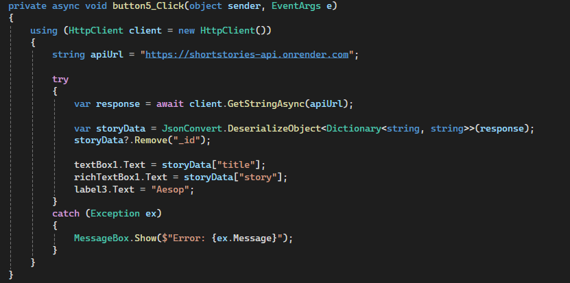

# 🎙️ Text-To-Speech Assistant

A tool designed to assist people with special needs by converting text into natural-sounding speech.  
The application includes built-in stories for listening, allows fetching additional stories from the internet via an API, and offers voice customization (volume and speed).

---

## ✨ Features

- 🔊 **Text-to-Speech**: Convert text into speech with natural voice.  
- 📚 **Built-in Stories**: Listen to preloaded stories.  
- 🌐 **Fetch Stories via API**: Retrieve extra stories from the web.  
- ⚙️ **Voice Controls**: Adjust speech volume and speed with trackbars.  
- 💾 **SQLite Database**: Save and manage stories locally.  
- ⭐ **Rate Us Button**: Demonstrates a redirect to the Google Play Store.  

---

## 🛠️ Technologies Used

- **Language**: C# (.NET Framework)  
- **GUI**: Windows Forms (or WPF, depending on implementation)  
- **Database**: SQLite  
- **IDE / Build Tool**: Visual Studio  

---

## 📷 Screenshots

> *(Add 1–2 images here for better presentation, for example:)*

- **UI Screenshot** – the main application window with controls (Play, Save, API fetch).  
- **Code Snippet** – a C# method that triggers the Text-to-Speech functionality.  

